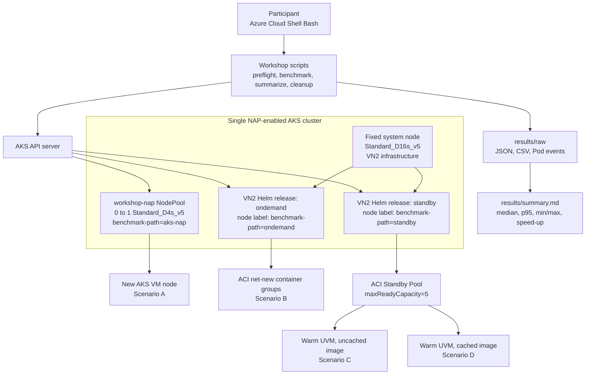

# ACI Basic 워크솝

> Korea Central 기준으로 **AKS NAP**, **VN2 OnDemand**, **StandbyPool**, **Image Cache** 경로를 같은 계약으로 비교하고, `5개 Pod × 3회` 측정에서 **12 raw JSON**과 all-success 기준 **60 Pod** evidence를 해석하는 180분 핸즈온 워크숍입니다.

---
> [!WARNING]
> 이 워크숍은 **전용 교육용 Azure 구독의 Owner 권한**을 전제로 합니다. 기존 production 구독이나 공유 AKS 클러스터에서 진행하지 마세요.

> [!WARNING]
> **비용**이 즉시 발생합니다. 실습 중에는 두 VN2 infrastructure release와 cluster system Pod를 호스팅하는 `Standard_D16s_v5` fixed system node, NAP benchmark 때 0→1로 생성되는 `Standard_D4s_v5` AKS VM, `cg` subnet에 연결한 **NAT Gateway** 와 **public IP**, **ACI OnDemand** container group, 그리고 StandbyPool의 **5개의 warm standby** container groups가 함께 사용됩니다. Module 07의 정리 절차를 생략하면 실습 종료 후에도 과금이 계속됩니다.

---

## 학습 목표

이 워크숍을 완료하면 다음을 할 수 있습니다.

1. AKS NAP, VN2 OnDemand, StandbyPool, Image Cache 네 경로의 lifecycle 차이를 설명할 수 있습니다.
2. `results/environment.json` 과 `results/workshop.env` 를 기준으로 workshop state를 복구할 수 있습니다.
3. `aks-nap`, `vn2-ondemand`, `vn2-standby`, `vn2-standby-cached`를 같은 계약으로 측정할 수 있습니다.
4. `results/summary.json`, `results/summary.csv`, `results/summary.md` 와 raw evidence를 함께 해석할 수 있습니다.
5. cleanup 완료 전까지 `Standby Pool running count is 5`, raw JSON 개수, residual resource IDs 같은 운영 체크포인트를 확인할 수 있습니다.

---

## 아키텍처



---

## 비교 시나리오

| ID | 시나리오 | 실행 위치 | 측정 목적 |
| --- | --- | --- | --- |
| `aks-nap` | AKS NAP | 요청 전 0개인 `workshop-nap` NodePool | VM allocation, bootstrap, node registration, image pull 포함 |
| `vn2-ondemand` | VN2 OnDemand | 새 ACI container group 생성 경로 | net-new provisioning + image pull 포함 시간 확인 |
| `vn2-standby` | StandbyPool | warm UVM, benchmark image 미보장 | standby capacity 자체 효과 분리 |
| `vn2-standby-cached` | StandbyPool cached | warm UVM + benchmark image cache | warm standby + cache 조합의 최고 성능 비교 |

### 네 시나리오가 구성되는 방식

이 워크숍은 네 개의 AKS 클러스터를 만드는 것이 아닙니다. **하나의 AKS API server** 아래에 다음 세 가지 node path를 준비하고, benchmark Pod의 `nodeSelector`를 바꿔 같은 manifest와 같은 이미지가 어느 경로에서 실행될지 고정합니다.

- `benchmark-path=aks-nap`: benchmark 요청이 올 때 `workshop-nap`이 만드는 AKS VM node
- `benchmark-path=ondemand`: `sandboxProviderType=OnDemand`인 VN2 virtual node
- `benchmark-path=standby`: `sandboxProviderType=StandbyPool`인 VN2 virtual node

fixed system node에는 benchmark label을 붙이지 않습니다. 이 node는 두 VN2 infrastructure release를 계속 호스팅하고, NAP benchmark NodePool은 0개 node에서 시작합니다. `vn2-standby`와 `vn2-standby-cached`는 서로 다른 virtual node가 아니며 둘 다 `benchmark-path=standby`를 사용합니다.

### 1. AKS NAP: Pending Pod가 새 VM node를 생성

AKS NAP 경로는 `workshop-nap` NodePool에 node와 NodeClaim이 0개인 상태에서 시작합니다. `benchmark-path=aks-nap`을 선택하고 전용 taint를 tolerate하는 Pod가 Pending되면 NAP가 on-demand `Standard_D4s_v5` node 한 대를 만듭니다.

- **준비 상태:** NAP node 0, NodeClaim 0이며 fixed system node에는 benchmark workload를 배치하지 않습니다.
- **생성 흐름:** Pod Pending → VM allocation → bootstrap → kubelet registration → image pull → container Ready.
- **SKU/용량:** `Standard_D4s_v5`, on-demand capacity, CPU limit 4로 최대 한 대만 허용합니다.
- **reset:** 각 run 뒤 namespace를 제거하고 consolidation으로 node와 NodeClaim이 다시 0이 될 때까지 기다립니다.
- **해석:** warm VM 기준선이 아니라 전체 AKS VM scale-out 시간입니다.

### 2. VN2 OnDemand: Pod 요청 시 새 ACI sandbox 생성

VN2 OnDemand 경로에서는 Kubernetes에 virtual node가 보이지만 실제 Pod compute는 AKS VM node가 아니라 **Azure Container Instances의 serverless infrastructure**에 생성됩니다. Pod가 `benchmark-path=ondemand`를 선택하면 VN2 provider가 delegated `cg` subnet에 새 ACI container group sandbox를 준비하고 benchmark container를 시작합니다.

- **준비 상태:** benchmark 요청 전에 해당 Pod용 ACI sandbox가 존재하지 않습니다.
- **생성 흐름:** Pod 생성 → virtual node 선택 → ACI compute 할당 및 container group 초기화 → 네트워크 연결 → image pull → container Ready 순서가 포함됩니다.
- **지연 특성:** net-new provisioning과 image pull이 모두 포함되어 네 경로 중 cold-start 비용이 가장 잘 드러납니다.
- **비용 특성:** 추가 AKS worker VM을 먼저 늘리지 않고 Pod 실행 시간에 맞춰 ACI compute를 사용할 수 있습니다.
- **적합한 경우:** 갑작스러운 burst, 일시적인 batch/job, VM node 증설을 기다리기 어려운 workload의 기준 경로입니다.

### 3. VN2 + StandbyPool: 사전 프로비저닝된 ACI compute 재사용

StandbyPool 경로도 Pod는 ACI에서 실행되지만, Pod 요청이 오기 전에 ACI container group용 compute를 미리 프로비저닝하고 초기화해 둡니다. 이 워크숍은 `standbyPoolShareType=Node`, `1 vCPU / 2 GiB` profile, `maxReadyCapacity=5`, `refillPolicy=always` 조건을 사용합니다.

- **준비 상태:** 최대 5개의 warm capacity가 running 상태로 대기합니다.
- **할당 흐름:** Pod 요청 → pool의 ready capacity 획득 → container 구성 및 시작 → 사용된 capacity를 pool이 다시 refill하는 흐름입니다.
- **지연 특성:** OnDemand의 compute allocation과 기반 초기화 대부분을 요청 전에 수행하므로 cold-start가 줄어듭니다.
- **비용 특성:** 빠른 시작을 위해 ready capacity를 미리 유지하므로 사용하지 않는 standby capacity에도 비용이 발생할 수 있습니다.
- **capacity 주의:** 요청 시 ready instance가 없으면 net-new ACI 생성으로 fallback될 수 있습니다. 이 경우 측정값에 OnDemand 성격이 섞이므로 benchmark 전후에 pool health와 `running=5`를 확인합니다.
- **적합한 경우:** 예측 가능한 burst, 짧은 응답 시간이 중요한 job runner, 일정한 최소 burst capacity를 예약하려는 workload에 적합합니다.

### 4. StandbyPool + Image Cache: compute와 container image를 함께 준비

StandbyPool이 compute 준비 시간을 줄여도 새 capacity가 benchmark image를 가지고 있지 않으면 첫 실행에서 registry image pull이 필요합니다. Image Cache 단계는 `microsoft.containerinstance.virtualnode.imagecachepod: "true"` annotation을 가진 cache 요청 Pod로 benchmark image를 사전에 준비하도록 요청합니다.

- **cache Pod의 역할:** 실제 latency sample이 아니라 standby capacity에 사용할 image를 알려 주는 request/template입니다.
- **재구성 이유:** uncached 측정에 사용한 기존 UVM을 그대로 두면 새 cache 요청이 반영된 capacity와 섞일 수 있습니다.
- **워크숍 절차:** uncached 측정 → Image Cache Pod 적용 → pool capacity 5→0으로 축소 → `running=0` 확인 → 0→5로 복구 → `running=5` 확인 → cached 측정 순서입니다.
- **지연 특성:** warm compute에 더해 image pull 경로까지 줄이는 것이 목적입니다. 특히 5개 Pod 전체가 Ready가 되는 batch all-ready 시간에서 효과를 확인합니다.
- **해석 주의:** cached의 first-ready가 항상 uncached보다 빠르다는 보장은 없습니다. Pod median, p95, batch first-ready와 batch all-ready를 함께 비교합니다.

### 경로별 차이 요약

| 비교 관점 | AKS NAP | VN2 OnDemand | StandbyPool | StandbyPool cached |
| --- | --- | --- | --- | --- |
| 실제 실행 compute | 요청 시 생성하는 AKS VM | 요청 시 생성하는 ACI | 미리 준비한 ACI capacity | 미리 준비한 ACI capacity |
| 요청 전 compute 상태 | NAP node/NodeClaim 0 | 없음 | warm/running | warm/running |
| 요청 전 image 상태 | 새 node라 pull 필요 | 기본적으로 pull 필요 | benchmark image 미보장 | benchmark image 사전 준비 요청 |
| 시작 지연에 포함되는 주요 작업 | VM allocation, bootstrap, registration, image pull, container 시작 | ACI 할당, 초기화, 네트워크, image pull, container 시작 | ready capacity 획득, image pull, container 시작 | ready capacity 획득, container 시작 |
| 유휴 비용 관점 | benchmark VM은 0으로 축소 | ready pool 없음 | standby capacity 유지 | standby capacity와 cache 준비 유지 |
| 이 워크숍의 측정 목적 | VM node scale-out | net-new serverless cold start | compute 사전 준비 효과 | compute + image 사전 준비 효과 |

네 경로 모두 Kubernetes Pod API로 생성하지만 실제 compute lifecycle과 비용 모델은 다릅니다. 그러므로 **AKS NAP와 VN2의 절대 시간 비교**, **OnDemand와 StandbyPool의 compute 준비 효과**, **기본 Standby와 cached의 image 준비 효과**를 각각 분리해서 해석해야 합니다.

구현과 측정 절차는 [Module 03: 이중 VN2 설치와 standby pool 준비](docs/03-install-dual-vn2.md), [Module 05: StandbyPool과 Image Cache 측정](docs/05-standby-cache-benchmark.md), [Module 06: 결과 분석과 해석](docs/06-analyze-results.md)에서 이어집니다. 제품 개념은 Microsoft Learn의 [Virtual nodes on Azure Container Instances](https://learn.microsoft.com/azure/container-instances/container-instances-virtual-nodes)와 [Standby pools for Azure Container Instances](https://learn.microsoft.com/azure/container-instances/container-instances-standby-pool-overview)를 참고하세요.

---

## Korea Central live rehearsal reference

2026-08-23 Korea Central에서 각 시나리오를 5 Pods × 3회 실행한 측정 reference입니다. Pod와 Batch ratio는 모두 **VN2 OnDemand median / candidate median**이며, 1보다 크면 candidate가 더 빨랐음을 뜻합니다.

| Scenario | Pod create→ready median | Batch all-ready median | Pod ratio | Batch ratio |
| --- | ---: | ---: | ---: | ---: |
| `aks-nap` | 84,590.3 ms | 85,613.0 ms | 0.620x | 0.635x |
| `vn2-ondemand` | 52,422.3 ms | 54,383.4 ms | baseline | baseline |
| `vn2-standby` | 8,216.7 ms | 21,153.3 ms | 6.380x | 2.571x |
| `vn2-standby-cached` | 5,431.7 ms | 8,067.0 ms | 9.651x | 6.741x |

세부 환경, p95, NAP 0→1→0 lifecycle, StandbyPool `healthy`/`running=5`, cache 5→0→5 recycle와 실패/timeout/fallback evidence는 [Korea Central 2026-08-23 live rehearsal reference](docs/reference/korea-central-2026-08-23.md)와 [reference JSON](docs/reference/korea-central-2026-08-23.json)에 있습니다. 이 결과는 특정 rehearsal의 reference일 뿐 SLA나 성능 보장이 아닙니다.

---

## 사전 요구사항

| 항목 | 설명 |
|------|------|
| Azure Portal Cloud Shell Bash 또는 동등한 Bash 환경 | 실습 명령은 Cloud Shell Bash 기준으로 작성되며, 로컬 환경을 사용하더라도 동일한 Bash 동작을 보장해야 합니다. |
| 전용 교육용 구독과 **Owner** 권한 | provider 등록, role assignment, cleanup, quota 확인을 한 번에 처리하려면 Owner 권한이 필요합니다. |
| 대상 지역 | **Korea Central** 를 기준으로 측정하며, 문서의 live reference와 비교할 때도 같은 지역을 사용합니다. |
| quota headroom | `Standard_D16s_v5`, `Standard_D4s_v5`, ACI StandardCores, container groups, standby refill을 동시에 감당할 여유가 있어야 합니다. |
| 저장소 쓰기 권한 | `results/` 아래에 raw evidence와 summary 산출물을 저장하고 유지할 수 있어야 합니다. |
| 기본 도구 | Module 01에서 Azure CLI, `kubectl`, `helm`, `jq`, `python3`, `git` 상태를 다시 확인합니다. |

---

## 모듈 구성

| Module | 주제 | 시간 | 결과 |
| --- | --- | ---: | --- |
| Module 00 | 개요와 측정 계약 | 5분 | 비교 기준, 지표, 비용, cleanup 원칙 이해 |
| Module 01 | 사전 검사와 참가 조건 확인 | 20분 | 도구, 권한, provider, feature, quota 확인 |
| Module 02 | Azure 기반 환경 준비 | 35분 | UAMI, custom VNet, NAP-enabled AKS, `workshop-nap` 준비 |
| Module 03 | 이중 VN2 설치 | 20분 | OnDemand/Standby release와 node label 준비 |
| Module 04 | AKS NAP와 OnDemand 측정 | 45분 | `aks-nap`, `vn2-ondemand` raw evidence 생성 |
| Module 05 | StandbyPool과 Image Cache 측정 | 30분 | `vn2-standby`, `vn2-standby-cached` raw evidence 생성 |
| Module 06 | 네 시나리오 결과 분석 | 15분 | summary JSON/CSV/Markdown 생성 및 해석 |
| Module 07 | 제약, 트러블슈팅, 정리 | 10분 | 오류 분류, 잔여 리소스 확인, 전체 cleanup |
|  | **합계** | **180분** |  |

---

## 문서 흐름

1. [Module 01](docs/01-prerequisites.md) — 사전 검사와 참가 조건 확인
2. [Module 02](docs/02-azure-foundation.md) — Azure 기반 환경 준비
3. [Module 03](docs/03-install-dual-vn2.md) — 이중 VN2 설치
4. [Module 04](docs/04-baseline-ondemand-benchmark.md) — AKS NAP와 VN2 OnDemand 측정
5. [Module 05](docs/05-standby-cache-benchmark.md) — StandbyPool과 Image Cache 측정
6. [Module 06](docs/06-analyze-results.md) — 결과 분석
7. [Module 07](docs/07-limitations-troubleshooting-cleanup.md) — 제약, 트러블슈팅, 정리

---

## 시간표

| 구간 | 내용 | 예상 시간 |
|------|------|-----------|
| 시작 | 개요 및 실습 범위 확인 | 5분 |
| 1부 | 사전 검사 + AKS NAP 기반 환경 준비 | 55분 |
| 2부 | 이중 VN2 설치 + AKS NAP/VN2 OnDemand 측정 | 65분 |
| 3부 | StandbyPool/Image Cache 측정 + 결과 분석 | 45분 |
| 마무리 | 제약 정리 + cleanup 검증 | 10분 |
| 합계 | 코어 워크숍 | 180분 |

> 리소스 그룹 삭제 요청은 180분 일정에 포함되지만, AKS 관련 비동기 정리와 Azure 백엔드 삭제 완료는 워크숍 종료 후까지 이어질 수 있습니다.

---

## 비용 개요

> 실습이 끝나면 반드시 [Module 07](docs/07-limitations-troubleshooting-cleanup.md)의 cleanup 절차를 수행하세요. 정확한 통화 금액은 구독, 리전, 실행 시간, 로그 수집량에 따라 달라지므로 이 문서에서는 고정 비용을 약속하지 않습니다.

| 리소스 | 과금 기준 | 실습 관점 메모 |
|--------|-----------|----------------|
| AKS fixed system node | `Standard_D16s_v5` 실행 시간 | 두 VN2 infrastructure release와 cluster system Pod를 계속 호스팅합니다. |
| AKS NAP benchmark node | `Standard_D4s_v5` 실행 시간 | `workshop-nap`이 0→1로 확장될 때만 비용이 발생합니다. |
| StandbyPool / ACI compute | warm standby + 실행 중 container group | `running=5` standby capacity와 benchmark burst가 함께 반영됩니다. |
| NAT Gateway + public IP | 시간 + 데이터 처리량 | `cg` subnet outbound 경로를 유지하는 동안 계속 과금됩니다. |
| Log storage in `results/` and Azure artifacts | raw evidence, summary, diagnostics 보관 | cleanup 전까지 evidence와 Azure 리소스가 함께 남습니다. |

---

## 태그 범례

| 태그 | 의미 |
|------|------|
| 🟢 **실행** | 참가자가 직접 입력하거나 수행해야 하는 단계 |
| 👁️ **설명** | 개념 설명 또는 읽기 전용 안내 |
| 📋 **예상 출력** | 실행 결과와 비교할 기준 출력 |
| ⚠️ **주의** | 보안, 비용, 제약 사항 안내 |

---

## 트러블슈팅 색인

| 증상 | 바로 갈 모듈 |
|------|----------------|
| `Microsoft.StandbyPool` provider, feature/role assignment, quota preflight가 실패함 | [docs/01-prerequisites.md#문제-해결](docs/01-prerequisites.md#문제-해결) |
| custom VNet, identity, kubelet, `workshop-nap` NodePool 준비가 실패함 | [docs/02-azure-foundation.md#문제-해결](docs/02-azure-foundation.md#문제-해결) |
| Helm install, webhook ownership, standby pool discovery가 꼬임 | [docs/03-install-dual-vn2.md#문제-해결](docs/03-install-dual-vn2.md#문제-해결) |
| `aks-nap` 또는 `vn2-ondemand` raw evidence가 부족하거나 zero-state가 깨짐 | [docs/04-baseline-ondemand-benchmark.md#문제-해결](docs/04-baseline-ondemand-benchmark.md#문제-해결) |
| standby refill, Image Cache recycle, cached retry 해석이 꼬임 | [docs/05-standby-cache-benchmark.md#문제-해결](docs/05-standby-cache-benchmark.md#문제-해결) |
| summary metric, ratio, per-run evidence 해석이 애매함 | [docs/06-analyze-results.md#문제-해결](docs/06-analyze-results.md#문제-해결) |
| cleanup, recovery, residual resource IDs 판단이 어렵다 | [docs/07-limitations-troubleshooting-cleanup.md#문제-해결](docs/07-limitations-troubleshooting-cleanup.md#문제-해결) |

---

## 참고 자료

- [Virtual nodes on Azure Container Instances](https://learn.microsoft.com/azure/container-instances/container-instances-virtual-nodes)
- [Standby pools for Azure Container Instances](https://learn.microsoft.com/azure/container-instances/container-instances-standby-pool-overview)
- [Korea Central 2026-08-23 live rehearsal reference](docs/reference/korea-central-2026-08-23.md)
- [Korea Central 2026-08-23 reference JSON](docs/reference/korea-central-2026-08-23.json)
- [AKS automatic node provisioning overview](https://learn.microsoft.com/azure/aks/node-autoprovision)

---

## 완료 기준

- [ ] Module 01에서 Owner 권한, provider 등록, 도구 버전, quota를 확인했다.
- [ ] Module 02에서 AKS와 `cg` subnet, NAT Gateway, public IP를 준비했다.
- [ ] Module 02와 Module 03에서 `results/workshop.env` 를 최신 값으로 저장했다.
- [ ] Module 02에서 `workshop-nap` NodePool Ready와 node/NodeClaim 0개를 확인했다.
- [ ] Module 03에서 fixed system node는 unlabeled 상태로 두고 `benchmark-path=ondemand|standby` virtual node를 준비했다.
- [ ] Module 04와 Module 05에서 네 시나리오의 12 raw JSON과 all-success 기준 60 Pod evidence를 만들었다.
- [ ] Module 06에서 `results/summary.json`, `results/summary.csv`, `results/summary.md`를 생성했다.
- [ ] 실패, timeout, fallback evidence를 삭제하지 않고 그대로 보관했다.
- [ ] Module 07까지 완료해 잔여 리소스가 없는지 확인했다.

---

## Operator-only smoke test checklist

- [ ] Fresh Cloud Shell Bash session에서 이 저장소만 열고 시작했다.
- [ ] Modules 01-07을 순서대로 끝냈고 Module 02/03 이후 `results/workshop.env` 를 계속 최신 상태로 유지했다.
- [ ] shell/session 이 바뀌었더라도 fresh Cloud Shell recovery 로 `source results/workshop.env` 후 같은 workshop state 를 다시 불러왔다.
- [ ] `kubectl get nodes -L benchmark-path` 에서 two VN2 virtual nodes show Ready concurrently 상태를 확인했다.
- [ ] `./scripts/check-standby-pool.sh -g "$RG" -n "$STANDBY_POOL" --expect-running 5 --timeout-seconds 1200 --interval-seconds 15` 로 Standby Pool running count is 5 임을 확인했다.
- [ ] `find results/raw -maxdepth 1 -type f -name '*.json' | wc -l` 결과가 exactly 12 raw JSON files 이다.
- [ ] `results/summary.json, results/summary.csv, and results/summary.md` 가 모두 생성되었다.
- [ ] No timeout/failure samples are hidden; `failed_count`, `timeout_count`, `non_ready_pods` 를 그대로 검토했다.
- [ ] `./scripts/cleanup.sh --resource-group "$RG" --yes` 뒤 `az group exists --name "$RG"` 결과가 `false` 다.

---

## Mandatory cleanup

실습이 끝나면 반드시 [Module 07](docs/07-limitations-troubleshooting-cleanup.md)의 cleanup 절차를 실행하세요.

```bash
./scripts/cleanup.sh --resource-group "$RG" --yes
az group exists --name "$RG"
```

`az group exists` 결과가 `false`가 될 때까지 확인해야 합니다. StandbyPool warm capacity와 ACI 리소스는 삭제 전까지 계속 비용을 발생시킵니다.
