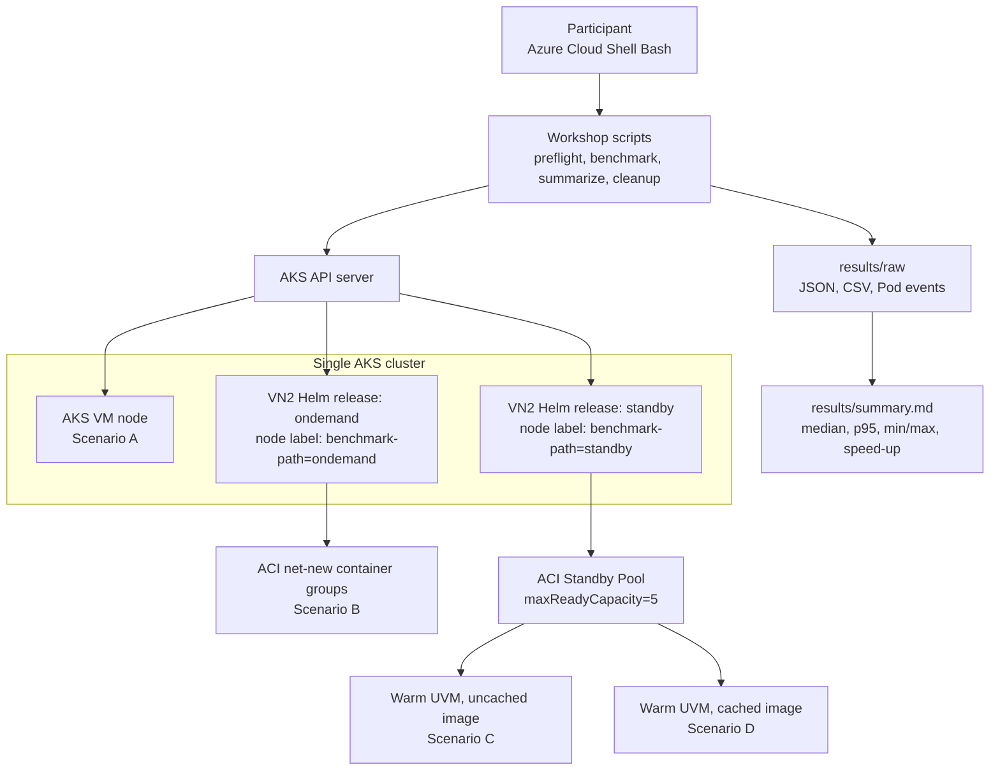

# ACI VN2 성능 워크숍 개요

이 저장소는 **Korea Central** 기준으로 일반 AKS 노드, **VN2 OnDemand**, **StandbyPool**, **Image Cache** 조합을 같은 조건으로 측정하는 150분 실습 안내서입니다. 목표는 참가자가 `5개 Pod × 3회` 반복 측정을 통해 Pod 시작 지연과 batch 완료 시간을 직접 수집하고 해석하도록 돕는 것입니다.

> [!WARNING]
> 이 워크숍은 **전용 교육용 Azure 구독의 Owner 권한**을 전제로 합니다. 기존 production 구독이나 공유 AKS 클러스터에서 진행하지 마세요.

> [!WARNING]
> **비용**이 즉시 발생합니다. 실습 중에는 AKS VM, `cg` subnet에 연결한 **NAT Gateway** 와 **public IP**, **ACI OnDemand** container group 생성, 그리고 StandbyPool의 **5개의 warm standby** container groups가 함께 유지됩니다. regular AKS VM은 `Standard_D16s_v5` 한 대를 유지한 1-node architecture 로 고정하며, 이는 두 VN2 infrastructure release와 benchmark Pod 5개 × 500m baseline 이 이전의 더 작은 regular node 크기에서는 CPU 부족으로 막혔기 때문입니다. Module 07의 정리 절차를 생략하면 실습 종료 후에도 과금이 계속됩니다.

## 빠른 시작

```bash
git clone <repository-url> ~/aci-vn2-performance-workshop
cd ~/aci-vn2-performance-workshop
```

실습은 Azure Portal Cloud Shell Bash를 기준으로 작성되었습니다. 로컬 터미널을 사용할 경우 `az`, `kubectl`, `helm`, `jq`, `python3`, `git` 버전이 Module 01 기준을 만족해야 합니다.

## Persisted workshop state

`results/workshop.env is the authoritative workshop state`. Module 02가 이 파일을 원자적으로 만들고, Module 03이 standby 관련 키를 같은 파일에 다시 기록합니다. 이후 participant 모듈은 가능하면 먼저 이 파일을 읽습니다.

fresh Cloud Shell recovery 가 필요하면 저장소 루트에서 아래처럼 다시 불러오십시오.

```bash
cd ~/aci-vn2-performance-workshop
source results/workshop.env
```

`results/workshop.env` 가 없다면 Module 07의 fresh-session recovery 절차로 정확한 workshop RG를 다시 확인한 뒤 파일을 복구하고 진행합니다.

## 아키텍처



## 비교 시나리오

| ID | 시나리오 | 실행 위치 | 측정 목적 |
| --- | --- | --- | --- |
| `aks` | 일반 AKS 노드 | 이미 준비된 일반 AKS 노드 | 프로비저닝된 VM 기준선 확보 |
| `vn2-ondemand` | VN2 OnDemand | 새 ACI container group 생성 경로 | net-new provisioning + image pull 포함 시간 확인 |
| `vn2-standby-uncached` | StandbyPool uncached | warm UVM, 이미지 캐시 없음 | standby capacity 자체 효과 분리 |
| `vn2-standby-cached` | StandbyPool cached | warm UVM + benchmark image cache | warm standby + cache 조합의 최고 성능 비교 |

### 네 시나리오가 구성되는 방식

이 워크숍은 네 개의 AKS 클러스터를 만드는 것이 아닙니다. **하나의 AKS API server** 아래에 다음 세 가지 node path를 동시에 준비하고, benchmark Pod의 `nodeSelector`를 바꿔 같은 manifest와 같은 이미지가 어느 경로에서 실행될지 고정합니다.

- `benchmark-path=aks`: 실제 AKS VM node
- `benchmark-path=ondemand`: `sandboxProviderType=OnDemand`인 VN2 virtual node
- `benchmark-path=standby`: `sandboxProviderType=StandbyPool`인 VN2 virtual node

`vn2-standby-uncached`와 `vn2-standby-cached`는 서로 다른 virtual node가 아닙니다. 둘 다 `benchmark-path=standby`를 사용하며, **Standby Pool에 준비된 compute만 있는지, compute와 benchmark image가 함께 준비되어 있는지**를 바꿔 측정합니다. 따라서 Image Cache는 다섯 번째 실행 환경이 아니라 StandbyPool 경로의 두 번째 준비 상태입니다.

### 1. 일반 AKS node: 이미 실행 중인 VM에 Pod 배치

일반 AKS 경로에서는 kube-scheduler가 Pod를 `Standard_D16s_v5` VM node에 배치합니다. VM, kubelet, 컨테이너 런타임과 노드 네트워크가 이미 실행 중이므로 Pod 생성 후에는 주로 스케줄링, 이미지 확인 또는 pull, 컨테이너 시작과 readiness 전환 시간이 측정됩니다.

- **준비 상태:** VM node가 항상 실행 중이며 워크숍 시작 전에 cluster capacity가 확보되어 있습니다.
- **이미지 상태:** 이전 실행으로 이미지가 node에 남아 있으면 warm image cache 효과가 포함될 수 있습니다.
- **지연 특성:** 새 VM이나 ACI sandbox를 만들지 않으므로 일반적으로 가장 짧은 Pod 시작 시간이 나옵니다.
- **비용 특성:** Pod가 없어도 AKS VM이 실행되는 동안 node 비용이 계속 발생합니다.
- **해석:** 이미 프로비저닝된 VM 기준선입니다. serverless burst 경로와 비용 조건이 다르므로 “가장 빠르니 항상 가장 경제적”이라고 해석하지 않습니다.

### 2. VN2 OnDemand: Pod 요청 시 새 ACI sandbox 생성

VN2 OnDemand 경로에서는 Kubernetes에 virtual node가 보이지만 실제 Pod compute는 AKS VM node가 아니라 **Azure Container Instances의 serverless infrastructure**에 생성됩니다. Pod가 `benchmark-path=ondemand`를 선택하면 VN2 provider가 delegated `cg` subnet에 새 ACI container group sandbox를 준비하고 benchmark container를 시작합니다.

- **준비 상태:** benchmark 요청 전에 해당 Pod용 ACI sandbox가 존재하지 않습니다.
- **생성 흐름:** Pod 생성 → virtual node 선택 → ACI compute 할당 및 container group 초기화 → 네트워크 연결 → image pull → container Ready 순서가 포함됩니다.
- **지연 특성:** net-new provisioning과 image pull이 모두 포함되어 네 경로 중 cold-start 비용이 가장 잘 드러납니다.
- **비용 특성:** 추가 AKS worker VM을 먼저 늘리지 않고 Pod 실행 시간에 맞춰 ACI compute를 사용할 수 있습니다.
- **적합한 경우:** 갑작스러운 burst, 일시적인 batch/job, VM node 증설을 기다리기 어려운 workload의 기준 경로입니다.

### 3. VN2 + StandbyPool: 사전 프로비저닝된 ACI compute 재사용

StandbyPool 경로도 Pod는 ACI에서 실행되지만, Pod 요청이 오기 전에 ACI container group용 compute를 미리 프로비저닝하고 초기화해 둡니다. 이 워크숍은 `standbyPoolShareType=Node`, `1 vCPU / 2 GiB` profile, `maxReadyCapacity=5`, `refillPolicy=always` 조건을 사용합니다.

- **준비 상태:** 최대 5개의 warm capacity가 running 상태로 대기합니다.
- **할당 흐름:** Pod 요청 → pool의 ready capacity 획득 → container 구성 및 시작 → 사용된 capacity를 pool이 다시 refill하는 흐름입니다.
- **지연 특성:** OnDemand의 compute allocation과 기반 초기화 대부분을 요청 전에 수행하므로 cold-start가 줄어듭니다.
- **비용 특성:** 빠른 시작을 위해 ready capacity를 미리 유지하므로 사용하지 않는 standby capacity에도 비용이 발생할 수 있습니다.
- **capacity 주의:** 요청 시 ready instance가 없으면 net-new ACI 생성으로 fallback될 수 있습니다. 이 경우 측정값에 OnDemand 성격이 섞이므로 benchmark 전후에 pool health와 `running=5`를 확인합니다.
- **적합한 경우:** 예측 가능한 burst, 짧은 응답 시간이 중요한 job runner, 일정한 최소 burst capacity를 예약하려는 workload에 적합합니다.

### 4. StandbyPool + Image Cache: compute와 container image를 함께 준비

StandbyPool이 compute 준비 시간을 줄여도 새 capacity가 benchmark image를 가지고 있지 않으면 첫 실행에서 registry image pull이 필요합니다. Image Cache 단계는 `microsoft.containerinstance.virtualnode.imagecachepod: "true"` annotation을 가진 cache 요청 Pod로 benchmark image를 사전에 준비하도록 요청합니다.

- **cache Pod의 역할:** 실제 latency sample이 아니라 standby capacity에 사용할 image를 알려 주는 request/template입니다.
- **재구성 이유:** uncached 측정에 사용한 기존 UVM을 그대로 두면 새 cache 요청이 반영된 capacity와 섞일 수 있습니다.
- **워크숍 절차:** uncached 측정 → Image Cache Pod 적용 → pool capacity 5→0으로 축소 → `running=0` 확인 → 0→5로 복구 → `running=5` 확인 → cached 측정 순서입니다.
- **지연 특성:** warm compute에 더해 image pull 경로까지 줄이는 것이 목적입니다. 특히 5개 Pod 전체가 Ready가 되는 batch all-ready 시간에서 효과를 확인합니다.
- **해석 주의:** cached의 first-ready가 항상 uncached보다 빠르다는 보장은 없습니다. Pod median, p95, batch first-ready와 batch all-ready를 함께 비교합니다.

### 경로별 차이 요약

| 비교 관점 | AKS node | VN2 OnDemand | StandbyPool uncached | StandbyPool cached |
| --- | --- | --- | --- | --- |
| 실제 실행 compute | 이미 실행 중인 AKS VM | 요청 시 생성하는 ACI | 미리 준비한 ACI capacity | 미리 준비한 ACI capacity |
| 요청 전 compute 상태 | VM Ready | 없음 | warm/running | warm/running |
| 요청 전 image 상태 | node cache 상태에 따라 다름 | 기본적으로 pull 필요 | benchmark image 미보장 | benchmark image 사전 준비 요청 |
| 시작 지연에 포함되는 주요 작업 | 스케줄링, image 확인/pull, container 시작 | ACI 할당, 초기화, 네트워크, image pull, container 시작 | ready capacity 획득, image pull, container 시작 | ready capacity 획득, container 시작 |
| 유휴 비용 관점 | VM node 비용 유지 | ready pool 없음 | standby capacity 유지 | standby capacity와 cache 준비 유지 |
| 이 워크숍의 측정 목적 | warm VM 기준선 | net-new serverless cold start | compute 사전 준비 효과 | compute + image 사전 준비 효과 |

네 경로 모두 Kubernetes Pod API로 생성하지만 실제 compute lifecycle과 비용 모델은 다릅니다. 그러므로 **AKS와 VN2의 절대 시간 비교**, **OnDemand와 StandbyPool의 compute 준비 효과**, **uncached와 cached의 image 준비 효과**를 각각 분리해서 해석해야 합니다.

구현과 측정 절차는 [Module 03: 이중 VN2 설치와 standby pool 준비](docs/03-install-dual-vn2.md), [Module 05: StandbyPool과 Image Cache 측정](docs/05-standby-cache-benchmark.md), [Module 06: 결과 분석과 해석](docs/06-analyze-results.md)에서 이어집니다. 제품 개념은 Microsoft Learn의 [Virtual nodes on Azure Container Instances](https://learn.microsoft.com/azure/container-instances/container-instances-virtual-nodes)와 [Standby pools for Azure Container Instances](https://learn.microsoft.com/azure/container-instances/container-instances-standby-pool-overview)를 참고하세요.

## 실제 리허설 참고 결과

2026-08-23 Korea Central에서 시나리오당 5 Pods × 3회로 전체 워크숍을 실행했으며 60/60 Pods가 Ready, 실패와 timeout은 0이었습니다. 당시 Standby cached는 VN2 OnDemand 대비 Pod median 9.796배, Batch all-ready median 7.062배 빨랐습니다.

이 수치는 워크숍 결과 해석을 돕는 참고 표본이며 SLA나 기대 출력이 아닙니다. 환경, 전체 표, p95와 리허설 중 발견한 운영상 주의사항은 [Korea Central 실제 리허설 참고 결과](docs/reference/korea-central-2026-08-23.md)를 확인하세요.

## 사전 요구 사항

- Azure Portal Cloud Shell Bash 또는 동등한 Bash 환경
- 전용 교육용 구독과 **Owner** 권한
- 대상 지역: **Korea Central**
- 워크숍용 리소스를 새로 만들 수 있는 quota 여유
- `results/` 디렉터리에 raw evidence를 보관할 수 있는 저장소 쓰기 권한

Module 01에서 provider 등록, quota, VM SKU, Helm/Kubernetes 도구 버전을 다시 확인합니다.

참가자 기본 노드 크기는 `Standard_D16s_v5` 입니다. live evidence 상 두 VN2 infrastructure release와 benchmark Pod 5개 × 500m baseline 을 같은 regular node에 함께 두면 이전의 더 작은 node 크기는 `Insufficient cpu` 로 막혔기 때문에, 이 워크숍은 한 대의 regular node만 유지하는 1-node architecture 를 그대로 두고 VM 크기만 올립니다.

## 모듈 구성

| Module | 주제 | 시간 | 결과 |
| --- | --- | ---: | --- |
| Module 00 | 개요와 측정 계약 | 5분 | 비교 기준, 지표, 비용, cleanup 원칙 이해 |
| Module 01 | 사전 검사와 참가 조건 확인 | 15분 | 도구, 권한, provider, feature, quota 확인 |
| Module 02 | Azure 기반 환경 준비 | 30분 | RG, VNet, delegated subnet, NAT Gateway, AKS 준비 |
| Module 03 | 이중 VN2 설치 | 20분 | OnDemand/Standby release와 node label 준비 |
| Module 04 | 기준선과 OnDemand 측정 | 25분 | `aks`, `vn2-ondemand` raw evidence 생성 |
| Module 05 | StandbyPool과 Image Cache 측정 | 25분 | `vn2-standby-uncached`, `vn2-standby-cached` raw evidence 생성 |
| Module 06 | 결과 분석 | 20분 | summary JSON/CSV/Markdown 생성 및 해석 |
| Module 07 | 제약, 트러블슈팅, 정리 | 10분 | 오류 분류, 잔여 리소스 확인, 전체 cleanup |

## 문서 흐름

1. [Module 01](docs/01-prerequisites.md) — 사전 검사와 참가 조건 확인
2. [Module 02](docs/02-azure-foundation.md) — Azure 기반 환경 준비
3. [Module 03](docs/03-install-dual-vn2.md) — 이중 VN2 설치
4. [Module 04](docs/04-baseline-ondemand-benchmark.md) — 기준선과 OnDemand 측정
5. [Module 05](docs/05-standby-cache-benchmark.md) — StandbyPool과 Image Cache 측정
6. [Module 06](docs/06-analyze-results.md) — 결과 분석
7. [Module 07](docs/07-limitations-troubleshooting-cleanup.md) — 제약, 트러블슈팅, 정리

## 완료 체크리스트

- [ ] Module 01에서 Owner 권한, provider 등록, 도구 버전, quota를 확인했다.
- [ ] Module 02에서 AKS와 `cg` subnet, NAT Gateway, public IP를 준비했다.
- [ ] Module 02와 Module 03에서 `results/workshop.env` 를 최신 값으로 저장했다.
- [ ] Module 03에서 `benchmark-path=aks|ondemand|standby` 경로를 모두 준비했다.
- [ ] Module 04와 Module 05에서 네 시나리오의 raw JSON evidence를 모두 만들었다.
- [ ] Module 06에서 `results/summary.json`, `results/summary.csv`, `results/summary.md`를 생성했다.
- [ ] 실패, timeout, fallback evidence를 삭제하지 않고 그대로 보관했다.
- [ ] Module 07까지 완료해 잔여 리소스가 없는지 확인했다.

## Operator-only smoke test checklist

- [ ] Fresh Cloud Shell Bash session에서 이 저장소만 열고 시작했다.
- [ ] Modules 01-07을 순서대로 끝냈고 Module 02/03 이후 `results/workshop.env` 를 계속 최신 상태로 유지했다.
- [ ] shell/session 이 바뀌었더라도 fresh Cloud Shell recovery 로 `source results/workshop.env` 후 같은 workshop state 를 다시 불러왔다.
- [ ] `kubectl get nodes -L benchmark-path` 에서 two VN2 virtual nodes show Ready concurrently 상태를 확인했다.
- [ ] `./scripts/check-standby-pool.sh -g "$RG" -n "$STANDBY_POOL" --expect-running 5 --timeout-seconds 1200 --interval-seconds 15` 로 Standby Pool running count is 5 임을 확인했다.
- [ ] `find results/raw -maxdepth 1 -type f -name '*.json' | wc -l` 결과가 exactly 12 raw JSON files 이다.
- [ ] `results/summary.json, results/summary.csv, and results/summary.md` 가 모두 생성되었다.
- [ ] No timeout/failure samples are hidden; `failed_count`, `timeout_count`, `non_ready_pods` 를 그대로 검토했다.
- [ ] `./scripts/cleanup.sh --resource-group "$RG" --yes` 뒤 `az group exists --name "$RG"` 결과가 `false` 다.

## Mandatory cleanup

실습이 끝나면 반드시 [Module 07](docs/07-limitations-troubleshooting-cleanup.md)의 cleanup 절차를 실행하세요.

```bash
./scripts/cleanup.sh --resource-group "$RG" --yes
az group exists --name "$RG"
```

`az group exists` 결과가 `false`가 될 때까지 확인해야 합니다. StandbyPool warm capacity와 ACI 리소스는 삭제 전까지 계속 비용을 발생시킵니다.
