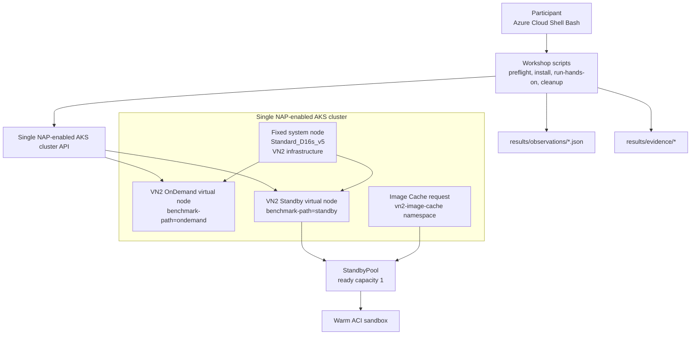

# ACI Basic 워크솝

> 120분 동안 VN2 OnDemand, StandbyPool, Image Cache 세 경로를 hands-on으로 따라가며, 각 경로에서 Pod 1개를 한 번 관찰하는 참가자용 워크숍입니다. 성능 benchmark가 아닙니다.

---

> [!WARNING]
> 이 워크숍은 **전용 교육용 Azure 구독의 Owner 권한**을 전제로 합니다. 운영 구독이나 공유 AKS 클러스터에서 그대로 재현하지 마세요.

> [!WARNING]
> 실습 중에는 `Standard_D16s_v5` fixed system node, VN2용 ACI sandbox, StandbyPool ready capacity 1, `cg` subnet의 NAT Gateway와 public IP가 함께 사용됩니다. Module 07의 cleanup를 건너뛰면 과금이 계속될 수 있습니다.

---

## 학습 목표

이 워크숍을 완료하면 다음을 할 수 있습니다.

1. NAP-enabled fixed-node AKS 위에 VN2 OnDemand와 StandbyPool 경로가 어떻게 공존하는지 설명할 수 있습니다.
2. Module 04-06에서 각 경로를 Pod 1개를 한 번 실행하는 방식으로 관찰하고, `results/observations/`와 `results/evidence/`를 확인할 수 있습니다.
3. `results/workshop.env`를 기준으로 fresh Cloud Shell에서도 같은 workshop state를 다시 불러올 수 있습니다.
4. StandbyPool ready capacity 1과 Image Cache 재구성(`1→0→1`)이 어떤 lifecycle 차이를 보여 주는지 정성적으로 설명할 수 있습니다.
5. 세 관찰값을 순위표로 바꾸지 않고 review한 뒤 exact RG cleanup까지 마무리할 수 있습니다.

---

## 아키텍처



한 개의 AKS API와 고정 system node 위에서 참가자는 세 가지 VN2 경로만 관찰합니다. Module 02는 foundation을 준비하고, Module 04-06은 각각 OnDemand, warm standby, cached standby path를 한 번씩 실행해 증적을 남깁니다.
실습에서 다루는 scenario ID는 `vn2-ondemand`, `vn2-standby`, `vn2-standby-cached` 입니다.

---

## 사전 요구사항

| 항목 | 설명 |
|------|------|
| Azure Cloud Shell Bash 또는 동등한 Bash 환경 | 문서의 명령은 Bash 기준이며, fresh shell에서 다시 실행해도 같은 동작을 보장해야 합니다. |
| 전용 교육용 구독과 **Owner** 권한 | provider 등록, role assignment, cleanup, quota 확인을 같은 흐름으로 수행합니다. |
| quota headroom | `Standard_D16s_v5` system node 1대와 ACI 2-unit headroom(`2 available container groups` + `2 available StandardCores`)을 동시에 감당해야 합니다. |
| 실습 지역 | 문서와 스크립트는 `koreacentral` 기준으로 작성되어 있습니다. |
| 저장소 쓰기 권한 | `results/workshop.env`, `results/observations/`, `results/evidence/`를 계속 갱신하고 보존합니다. |
| 기본 도구 | `az`, `kubectl`, `helm`, `jq`, `python3`, `git`을 Module 01에서 다시 확인합니다. |

---

## 모듈 구성

| Module | 주제 | 시간 | 결과 |
| --- | --- | ---: | --- |
| Module 00 | 개요와 VN2 lifecycle | 5분 | 세 경로와 비-benchmark 관찰 기준 이해 |
| Module 01 | 사전 요구사항 | 15분 | D16, ACI 2-unit, provider, 권한 검증 |
| Module 02 | Azure/AKS foundation | 30분 | NAP-enabled fixed-node AKS 생성 |
| Module 03 | Dual VN2와 StandbyPool | 20분 | OnDemand/Standby virtual node와 ready 1 준비 |
| Module 04 | VN2 OnDemand hands-on | 10분 | Pod 1개 create-to-Ready 관찰 |
| Module 05 | StandbyPool hands-on | 15분 | warm Pod 1개와 refill 관찰 |
| Module 06 | Image Cache hands-on | 15분 | pool 1→0→1 후 cached Pod 1개 관찰 |
| Module 07 | 회고와 cleanup | 10분 | 세 관찰 해석과 전체 삭제 |
|  | **합계** | **120분** |  |

---

## 문서 흐름

1. [Module 01](docs/01-prerequisites.md) — 구독, provider, 권한, quota preflight
2. [Module 02](docs/02-azure-foundation.md) — identity, VNet, NAT, AKS foundation
3. [Module 03](docs/03-install-dual-vn2.md) — dual VN2 install과 standby ready 1 준비
4. [Module 04](docs/04-vn2-ondemand-hands-on.md) — VN2 OnDemand observation
5. [Module 05](docs/05-standby-pool-hands-on.md) — StandbyPool observation
6. [Module 06](docs/06-image-cache-hands-on.md) — Image Cache observation
7. [Module 07](docs/07-limitations-troubleshooting-cleanup.md) — review, troubleshooting, cleanup

Module 03 이후 fresh shell에서 다시 들어올 때의 최소 시작점은 아래 두 줄입니다.

```bash
cd ~/aci-vn2-performance-workshop
source results/workshop.env
```

---

## 완료 기준

- [ ] Module 01에서 Owner 권한, provider 등록, ACI 2-unit quota 여유를 확인했다.
- [ ] Module 02에서 `Standard_D16s_v5` fixed system node를 사용하는 AKS foundation을 만들었다.
- [ ] Module 03에서 VN2 OnDemand/Standby virtual node와 standby ready capacity 1을 확인했다.
- [ ] Module 04-06에서 세 경로를 각각 Pod 1개를 한 번 실행하고 `results/observations/*.json`을 남겼다.
- [ ] Module 04-06의 `results/evidence/` 디렉터리에서 phase, standby pre/post, cache recycle 증적을 다시 열 수 있다.
- [ ] Module 07에서 세 관찰값을 순위화하지 않고 worksheet로 review했다.
- [ ] `results/workshop.env`를 fresh shell에서 다시 source 할 수 있다.
- [ ] final cleanup 뒤 `az group exists --name "$RG"` 결과를 `false`로 확인했다.

---

## 시간표

| 구간 | 내용 | 예상 시간 |
|------|------|---------:|
| 오리엔테이션 | Module 00 | 5분 |
| 사전 점검과 foundation | Module 01-02 | 45분 |
| Dual VN2 설치 | Module 03 | 20분 |
| 세 경로 hands-on 관찰 | Module 04-06 | 40분 |
| 회고와 cleanup | Module 07 | 10분 |
| 합계 | 참가자 동선 | 120분 |

---

## 비용 개요

> 고정 통화 금액은 약속하지 않습니다. 구독, 리전, 실행 시간, 로그 보존량에 따라 달라집니다. 실습이 끝나면 반드시 Module 07의 cleanup를 수행하세요.

| 리소스 | 과금 기준 | 실습 관점 메모 |
|--------|-----------|----------------|
| AKS fixed system node | `Standard_D16s_v5` 실행 시간 | 두 VN2 release와 system Pod를 계속 호스팅합니다. |
| VN2 OnDemand path | 실제 Pod 요청 시 생성되는 ACI sandbox | Pod가 실행될 때마다 net-new 경로를 관찰합니다. |
| StandbyPool | warm standby capacity 유지 시간 | ready capacity 1을 계속 유지하므로 유휴 비용이 생길 수 있습니다. |
| Image Cache path | cache request + recycle 후 warm capacity | same pool을 `1→0→1`로 재구성한 뒤 cached path를 다시 관찰합니다. |
| NAT Gateway + public IP | 시간 + 데이터 처리량 | `cg` subnet outbound를 유지하는 동안 과금됩니다. |

---

## 태그 범례

| 태그 | 의미 |
|------|------|
| 🟢 **실행** | 참가자가 직접 입력하거나 수행해야 하는 단계 |
| 👁️ **설명** | 개념 설명 또는 읽기 전용 안내 |
| 📋 **예상 출력** | 실행 결과와 비교할 기준 출력 |
| ⚠️ **주의** | 보안, 비용, 제약 사항 안내 |

---

## 트러블슈팅 색인

| 증상 | 바로 갈 문서 |
|------|---------------|
| provider, role assignment, quota preflight가 실패한다 | [docs/01-prerequisites.md#문제-해결](docs/01-prerequisites.md#문제-해결) |
| identity, VNet, NAT, AKS foundation 준비가 실패한다 | [docs/02-azure-foundation.md#문제-해결](docs/02-azure-foundation.md#문제-해결) |
| dual VN2 install, webhook ownership, standby discovery가 꼬인다 | [docs/03-install-dual-vn2.md#문제-해결](docs/03-install-dual-vn2.md#문제-해결) |
| VN2 OnDemand observation에서 phase 전환이 보이지 않는다 | [docs/04-vn2-ondemand-hands-on.md#문제-해결](docs/04-vn2-ondemand-hands-on.md#문제-해결) |
| same pool이 running 1을 채우지 못한다 | [docs/05-standby-pool-hands-on.md#문제-해결](docs/05-standby-pool-hands-on.md#문제-해결) |
| Image Cache recycle(`1→0→1`) 또는 cached observation 해석이 흔들린다 | [docs/06-image-cache-hands-on.md#문제-해결](docs/06-image-cache-hands-on.md#문제-해결) |
| review, fresh Cloud Shell recovery, cleanup 판단이 어렵다 | [docs/07-limitations-troubleshooting-cleanup.md#문제-해결](docs/07-limitations-troubleshooting-cleanup.md#문제-해결) |

---

## 참고 자료

- [Virtual nodes on Azure Container Instances](https://learn.microsoft.com/azure/container-instances/container-instances-virtual-nodes)
- [Standby pools for Azure Container Instances](https://learn.microsoft.com/azure/container-instances/container-instances-standby-pool-overview)
- [AKS automatic node provisioning overview](https://learn.microsoft.com/azure/aks/node-autoprovision)
- [선택 사항: 과거 성능 benchmark](docs/appendix/performance-benchmark.md)
